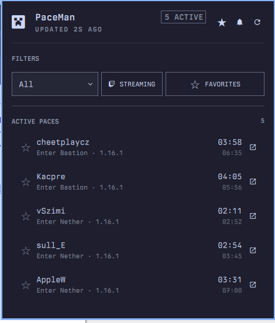
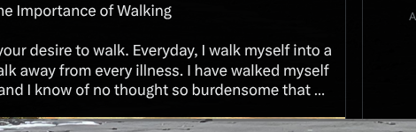
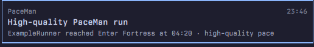

# PaceMan for Omarchy

[](https://omarchy.org/)
[](manifest.json)
[](LICENSE)

Follow live Minecraft speedrunning (MCSR) Random Seed Glitchless (RSG) paces
from [PaceMan.gg](https://paceman.gg/) directly from the Omarchy bar.



PaceMan adds a compact Minecraft icon to the bar. Open it for the global pace
board, current splits, estimated elapsed times, Twitch links, favorites, and
actionable pace notifications. The interface uses Omarchy's active colors,
spacing, typography, controls, and panel behavior.

## Features

- Live MCSR standard RSG paces from PaceMan's public liveruns feed
- Minecraft version, Twitch streaming, and favorite-runner filters
- PaceMan high-quality markers without hard-coded badge colors
- Expandable completed-split history for every active run
- Persistent favorite runners with add, remove, and row-star actions
- Favorite-start, high-quality, and configurable split notifications
- Per-split enable switches and editable `MM:SS` thresholds
- Notification actions that open Twitch or the runner's PaceMan profile
- Stale/offline state, retry backoff, and cross-display alert deduplication
- Full mouse and keyboard operation

## Install

```bash
omarchy plugin add https://github.com/nille/omarchy-paceman --enable
```

Without `--enable`, add PaceMan later through **Omarchy menu -> Bar ->
Widgets**, or run:

```bash
omarchy plugin enable nille.paceman --section right
```

The plugin has no build step, API key, account login, helper daemon, or extra
package dependency. It uses facilities already included with Omarchy.

## Controls

| Action | Result |
| --- | --- |
| Left-click the bar icon | Open or close the pace board |
| Middle-click the bar icon | Refresh immediately |
| Right-click the bar icon | Open PaceMan.gg |
| Click a run | Expand or collapse its completed splits |
| Click a runner star | Add or remove that runner from favorites |
| Click the external-link action | Open Twitch or the PaceMan profile |
| Click the freshness text | Change the `2-60` second refresh interval |
| Click the header star | Manage favorite runners and their alerts |
| Click the header bell | Configure quality and split notifications |

Keyboard navigation supports `j`/`k`, `Enter`, `f` to favorite, `o` to open,
`r` to refresh, and `Esc` to close.

## Notifications



Fresh installations start with a conservative notification policy:

| Setting | Default |
| --- | --- |
| Streaming runners only | On |
| High-quality pace alerts | On |
| Favorite runner alerts | Off |
| Split threshold alerts | Off |
| Individual split alerts | Off |

The threshold values remain populated when alerts are disabled, so users can
turn on only the splits they care about:

| Split | Default threshold |
| --- | ---: |
| Enter Nether | `02:00` |
| Enter Bastion | `04:30` |
| Enter Fortress | `04:30` |
| First Portal | `06:00` |
| Second Portal | `07:00` |
| Enter Stronghold | `07:30` |
| Enter End | `08:00` |
| Finish | `10:00` |

Blank or `0` disables an individual threshold. When several alert conditions
apply to the same split, PaceMan sends one combined notification. The first
API snapshot and reconnect snapshots never replay already-active runs.

Notifications use the bundled Minecraft face icon and include a **Watch
live** action when a Twitch stream is available. Otherwise, the action opens
the runner's PaceMan profile.



## Favorites

Open the header star to:

- enable or disable favorite-runner start notifications;
- add a Minecraft username directly;
- review the complete persisted favorites list; and
- remove runners that are no longer relevant.

Stars on active run rows update the same list. Favorites are matched
case-insensitively and pinned above the remaining pace board.

## Data and privacy

The plugin polls PaceMan's public standard RSG liveruns endpoint every 15
seconds by default. In this context, **MCSR** is the broader Minecraft
speedrunning ecosystem, while **RSG** is the specific run category exposed by
this feed. The plugin does not request or store Minecraft credentials,
Microsoft authentication, PaceMan tracker access keys, or Twitch tokens.

Configuration is stored by Omarchy in the widget entry inside
`~/.config/omarchy/shell.json`. Notification deduplication uses short-lived
files below `$XDG_RUNTIME_DIR`.

All Advancements runs use a separate PaceMan feed and are outside this
plugin's current scope.

## Uninstall

To disable PaceMan without deleting its checkout:

```bash
omarchy plugin disable nille.paceman
```

To remove the plugin completely:

```bash
omarchy plugin remove nille.paceman
```

The remove command asks for confirmation. No cleanup script is required:
Omarchy removes the plugin checkout and its bar entry, while short-lived
notification deduplication files disappear with the user session.

## Development

Validate the manifest and run the pure QML test suite:

```bash
omarchy plugin validate .
QT_QPA_PLATFORM=offscreen QT_QPA_PLATFORMTHEME= \
  /usr/lib/qt6/bin/qmltestrunner -input tests/qml
```

Launch the standalone live-data harness:

```bash
tests/harness/run
```

`Model.js` contains parsing, sorting, formatting, favorites, threshold, and
alert-transition logic. `Panel.qml` owns network transport, persistence,
interaction, and rendering. Harness notifications are disabled.

## Troubleshooting

- **No runs appear:** clear the streaming/favorites filters, try **All**
  versions, and click refresh.
- **The panel shows stale data:** PaceMan may be unavailable; the last valid
  board remains visible while retries use bounded backoff.
- **A notification does not appear:** check the streaming-only gate, the
  relevant alert master, and the individual split switch.
- **A change does not reload during development:** run
  `omarchy-shell shell rescanPlugins` or `omarchy restart shell`.

## Acknowledgements

Data is provided by [PaceMan.gg](https://paceman.gg/). Pace classification
follows PaceMan's public live-run data and current high-quality criteria.

This is an independent community plugin. It is not affiliated with or
endorsed by PaceMan, Mojang Studios, Microsoft, or Twitch. Minecraft is a
trademark of Microsoft Corporation.
